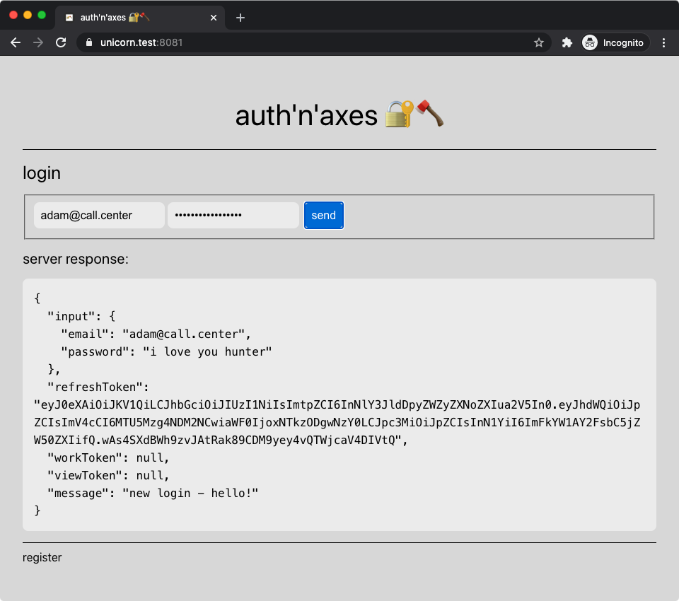

  🔐🪓

<h1 align="center">
  auth and axes
</h1>

   Exploring ways of authorization, authentication, and access control

## screenshots

### day 1: basic setup

* set up docker-compose stuff
* add plain and hardcoded "SPA", served via nginx
* add API backend services (Rust, tide)
* add some more nginx for TLS termination of backends (tide has no support yet)
* use mkcert for TLS on localhost
* add some *.test domains for localhost to `/etc/hosts`

**Note:** the JSON response is for debuggin only, never ever shall you return plain text credentials!
Also the JWT is part of an httpOnly and secure cookie and shall never be accessed by any 3rd party.

## name

*axes* [ˈæksɪz] is a pronunciation pun on *access* [ˈæksɛs].
